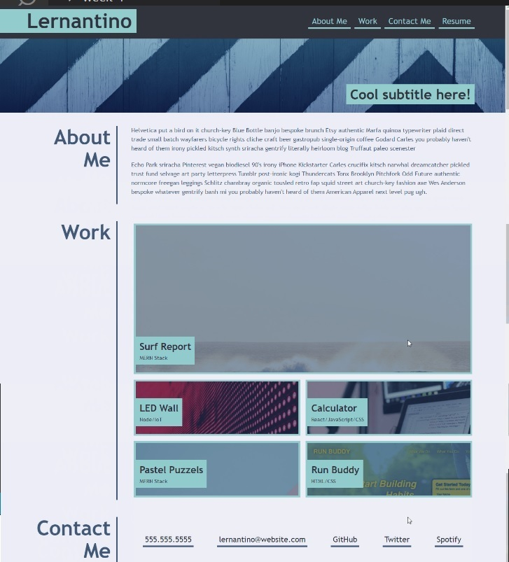

# Profolio - George Oustapasidis  

## Description

In this project, our objective is to create personal portfolio that will showcase the work and projects that have been completed.

 To do this we created a page using HTML and CSS which also shows our knowledge and undrestanding of our abilities as a web developer. 

Profesionals within the tech industry consider the importance of having such live Portfolio as it gives a insight in a candidates ability. 

 
 

## Demo Representation of ideal Portfolio webpage

## Installation
You can download the file in your local machine and unzip the folder containing a starter base html and css to help get you started
  
https://static.fullstack-bootcamp.com/uk-16/activities/02-css-module/04-responsive-portfolio-lesson/challenge.zip
 
 

## Deployment of Portfolio webpage
https://georgegio.github.io/Portfolio_Page/  

## License
Copyright (c) Microsoft Corporation. All rights reserved.

Licensed under the [MIT](./LICENSE) license.

